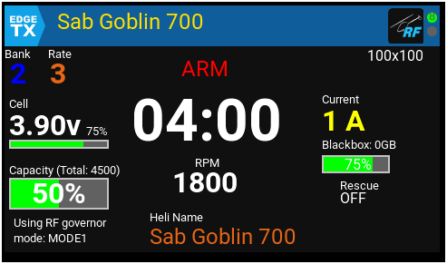

# Rotorflight Suite of LUA scripts for EdgeTx

rotorflight2 suite for edgeTx

Note: The work is still work in progress, (and probably will always be 😉 ) 
I hope others will find it as useful as I do

# Scripts

## RF2_touch - configuration lua script

# Widgets

## widget - rf2_server
background communication widget

* a must have background widget (that serve all other widget)
* it do all the communication to the FC
* should be installed on the topbar
* replace the original rf2bkg script
* replace the original rf2tlm script 
* new technology that detect elrs custom telemetry at correct order is already built-in (so no special procedure is needed for sensor discovery)

So, no need to define any scripts in special-function or custom-script anymore.

## rf2_name
used in single-tx-model (to many heli) configuration

* display the name of the heli that currently connected (not the name of the TX model)
* when another heli connected the name automatically change 

## rf2_image
used in single-tx-model (to many heli) configuration

* display the image of the heli based on it's name
* the image should exist on /IMAGES/<craft-name>.png
* when another heli connected the image automatically change
* it is NOT the image of the model as selected in the model-settings

## rf2_dash - dashboard widget
a dashboard of most needed info
* important RF2 telemetry 
* important elrs telemetry

## Requieremns
* Rotorflight 2.1.x and above
* edgeTx 2.10.x (currently, but will be deprecated soon)
* edgeTx 2.11.x
* color touch screen 480x272 resolution (radiomaster TX16s or similar)
* ELRS protocol (accst may be supported in the future)
* 
